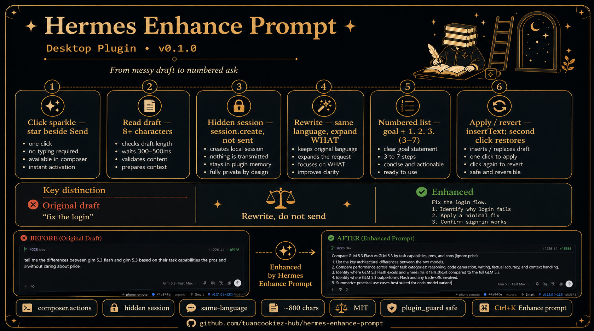
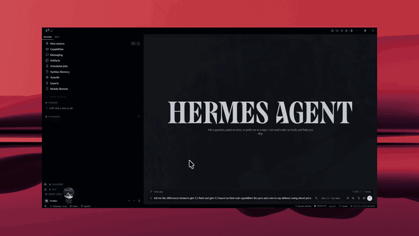

# Hermes Enhance Prompt



Sparkle beside Send on [Hermes Desktop](https://hermes-agent.nousresearch.com). Click it to rewrite the composer draft. It does **not** send the message.

- Type a messy prompt → sparkle → clearer, more specific draft as `1. 2. 3.`
- Click again to revert
- Click while spinning to cancel the wait
- Ctrl/Cmd+K → **Enhance prompt**

Uses your current Desktop model via a hidden Hermes session. Same language as the original. Does not invent tech you did not name. Does not answer the question — it expands it into a numbered task list.

## Demo



Messy draft → sparkle → numbered ask. It does not send.

Higher-quality MP4: [assets/demo-enhance-prompt.mp4](assets/demo-enhance-prompt.mp4)

---

## Desktop: the sparkle

### Install (paste into Hermes to have another agent do it)

```
Install the enhance-prompt plugin from tuancookiez-hub/hermes-enhance-prompt.

1. Clone or pull the repo:
   git clone https://github.com/tuancookiez-hub/hermes-enhance-prompt.git
   cd hermes-enhance-prompt
2. Copy desktop/plugin.js to:
   <HERMES_HOME>/desktop-plugins/enhance-prompt/plugin.js
   Folder name MUST be enhance-prompt.
3. In Hermes Desktop: Ctrl/Cmd+K → Reload desktop plugins
   (or Settings → Plugins → Enhance Prompt on)
4. Type in the composer and click the sparkle next to Send.
```

`HERMES_HOME` is normally `%LOCALAPPDATA%\hermes` on Windows,
`~/.hermes` on macOS/Linux.

> **Note:** `hermes plugins install` installs *Python agent plugins* (the kind
> documented at `hermes-agent.nousresearch.com`). Enhance Prompt is a
> *Desktop UI plugin* — a different runtime. Follow step 2 above instead.

Manual copy if you skip the installer:

```
# default profile
<HERMES_HOME>/desktop-plugins/enhance-prompt/plugin.js

# named profile
<HERMES_HOME>/profiles/<name>/desktop-plugins/enhance-prompt/plugin.js
```

The Desktop watches that folder. Drop the file in; no `npm run pack`.

### How the sparkle works

1. Reads the composer (`data-slot="composer-rich-input"`)
2. Hidden `session.create` + rewrite system prompt
3. `prompt.submit` the draft
4. Polls `session.history` until the assistant text settles
5. Replaces the box with `document.execCommand('insertText')` so the Desktop draft engine sees it

Cancel is UI-only. The hidden session may still finish.

---

## Agent: `/enhance` + `enhance_prompt` tool

This repo also registers a slash command and a tool so the rewrite logic works
from the CLI, gateway, MCP hosts, and any other surface that picks up agent plugins:

```
/enhance fix the login flow
```

or via the `enhance_prompt` tool:

```
enhance_prompt(input="fix the login", max_chars=600)
```

Both paths use the same rewrite prompt as the Desktop sparkle.

---

## Limits

- Desktop sparkle needs a live Desktop gateway and a working model
- Desktop sparkle costs one model turn per click
- Plugins cannot call `setComposerDraft` on the public SDK, so the Desktop write path is DOM-based
- Empty drafts under 8 characters are ignored

## Installing-agent notes

Full install/verify/uninstall steps for an agent live in `INSTALL.md`.

## License

MIT — see `LICENSE`.
